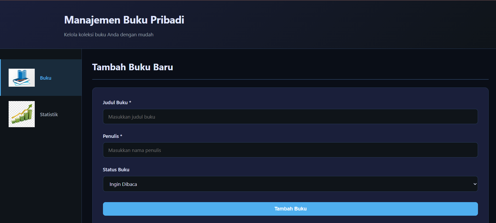
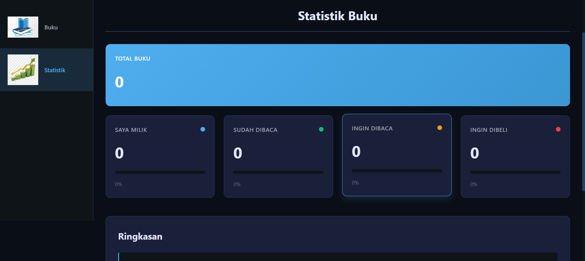

# Aplikasi Manajemen Buku Pribadi

Aplikasi modern untuk mengelola koleksi buku pribadi Anda dengan antarmuka yang intuitif dan responsif.

## Fitur Utama

- **Tambah Buku**: Tambahkan buku baru ke koleksi dengan judul, penulis, dan status
- **Edit Buku**: Perbarui informasi buku yang sudah ada
- **Hapus Buku**: Hapus buku dari koleksi
- **Filter & Cari**: Filter buku berdasarkan status dan cari berdasarkan judul/penulis
- **Statistik**: Lihat statistik lengkap koleksi buku Anda
- **Penyimpanan Lokal**: Data tersimpan otomatis di browser Anda

  

## Status Buku

- **Saya Milik**: Buku yang Anda miliki
- **Sudah Dibaca**: Buku yang sudah Anda baca
- **Ingin Dibaca**: Buku yang ingin Anda baca
- **Ingin Dibeli**: Buku yang ingin Anda beli

## Teknologi

- **React** 18.2.0 - Library UI
- **React Router** 6.20.0 - Navigasi multi-halaman
- **Vite** 5.1.0 - Build tool dan development server
- **CSS Vanilla** - Styling tanpa framework
- **Vitest & React Testing Library** - Testing

## Instalasi

### Prerequisites

- Node.js 16+ dan npm/yarn

### Langkah-langkah

1. **Clone atau download project ini**
2. **Install dependencies**
   \`\`\`bash
   npm install
   \`\`\`
3. **Jalankan development server**
   \`\`\`bash
   npm run dev
   \`\`\`

   Aplikasi akan membuka di `http://localhost:3000`

## Penggunaan

### Menambah Buku Baru

1. Di halaman Home, isi form "Tambah Buku Baru"
2. Masukkan judul, penulis, dan pilih status
3. Klik "Tambah Buku"

### Mengedit Buku

1. Klik tombol Edit pada kartu buku
2. Ubah informasi yang diinginkan
3. Klik "Perbarui Buku"

### Menghapus Buku

1. Klik tombol Hapus pada kartu buku
2. Konfirmasi penghapusan

### Mencari & Filter

1. Gunakan search box untuk mencari berdasarkan judul/penulis
2. Klik tombol filter untuk memfilter berdasarkan status

### Melihat Statistik

1. Klik menu "Statistik" di sidebar
2. Lihat ringkasan dan visualisasi data koleksi Anda

## Struktur Folder

\`\`\`
src/
├── components/
│   ├── BookForm/        # Komponen form tambah/edit buku
│   ├── BookList/        # Komponen daftar buku
│   ├── BookCard/        # Komponen kartu buku individual
│   ├── BookFilter/      # Komponen filter dan search
│   ├── Header/          # Header aplikasi
│   └── Sidebar/         # Sidebar navigasi
├── pages/
│   ├── Home/            # Halaman utama
│   └── Stats/           # Halaman statistik
├── hooks/
│   ├── useLocalStorage.js   # Custom hook localStorage
│   └── useBookStats.js      # Custom hook statistik
├── context/
│   └── BookContext.jsx      # Context API untuk state management
├── __tests__/
│   ├── BookContext.test.jsx
│   ├── useLocalStorage.test.jsx
│   ├── useBookStats.test.jsx
│   └── BookForm.test.jsx
├── App.jsx              # Root component
└── main.jsx             # Entry point
\`\`\`

## Custom Hooks

### useLocalStorage

Menyimpan dan retrieve data dari localStorage dengan error handling.

\`\`\`jsx
const [books, setBooks] = useLocalStorage('books', [])
\`\`\`

### useBookStats

Menghitung statistik buku termasuk total dan distribusi per status.

\`\`\`jsx
const stats = useBookStats()
// stats.total
// stats.byStatus
// stats.percentages
\`\`\`

## Testing

Jalankan test suite:

\`\`\`bash
npm run test
\`\`\`

Buka test UI:

\`\`\`bash
npm run test:ui
\`\`\`

### Test Coverage

- **BookContext.test.jsx**: CRUD operations dan filtering
- **useLocalStorage.test.jsx**: Storage dan persistence
- **useBookStats.test.jsx**: Kalkulasi statistik
- **BookForm.test.jsx**: Form validation dan submission

## Pelaporan Error

Jika mengalami error saat input form, pesan error akan ditampilkan di bawah field yang bermasalah. Perbaiki input dan pesan error akan hilang otomatis.

## Fitur Dokumentasi

Setiap file mendapat:

- Comments untuk bagian penting
- JSDoc untuk functions dan hooks
- README yang komprehensif
- Structure yang modular dan terorganisir

## Build untuk Production

\`\`\`bash
npm run build
\`\`\`

Output akan berada di folder `dist/`

## Dibuat dengan 

Aplikasi ini dibuat menggunakan React, Vite, dan CSS Vanilla.
