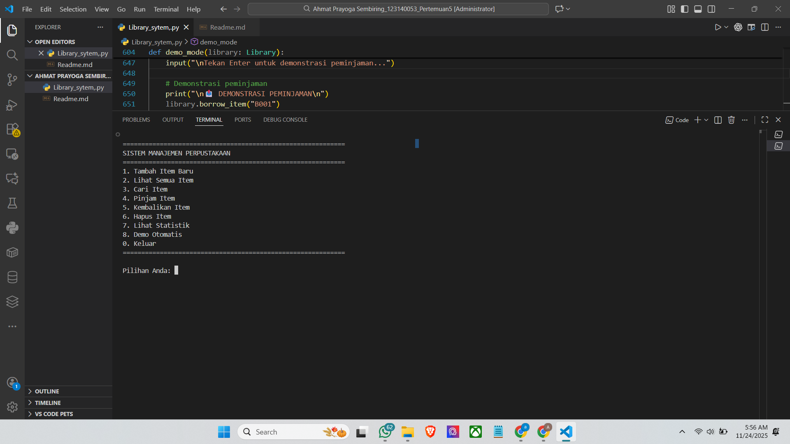

# 📚 Sistem Manajemen Perpustakaan - OOP Python

## 📖 Deskripsi Program

Sistem Manajemen Perpustakaan adalah aplikasi berbasis Python yang menerapkan konsep Object-Oriented Programming (OOP) secara komprehensif. Program ini dirancang untuk mengelola koleksi perpustakaan yang mencakup berbagai jenis item seperti buku, majalah, dan DVD.

### ✨ Fitur Utama

1. **Manajemen Item Perpustakaan**
   * Menambahkan item baru (buku, majalah, DVD)
   * Menghapus item dari koleksi
   * Menampilkan daftar semua item
   * Menampilkan detail lengkap setiap item
2. **Sistem Peminjaman**
   * Meminjam item dari perpustakaan
   * Mengembalikan item yang dipinjam
   * Tracking status ketersediaan item
3. **Pencarian Item**
   * Pencarian berdasarkan judul (partial match)
   * Pencarian berdasarkan ID unik
4. **Statistik Perpustakaan**
   * Total item dalam koleksi
   * Jumlah item tersedia
   * Jumlah item dipinjam
   * Total peminjaman yang pernah dilakukan

---

## 🎯 Implementasi Konsep OOP

### 1. **Abstract Class & Inheritance (30%)**

**Abstract Class: `LibraryItem`**

```python
class LibraryItem(ABC):
    @abstractmethod
    def display_info(self) -> str:
        pass
  
    @abstractmethod
    def get_item_type(self) -> str:
        pass
```

**Subclasses:**

* `Book` - Mewarisi dari LibraryItem untuk item buku
* `Magazine` - Mewarisi dari LibraryItem untuk item majalah
* `DVD` - Mewarisi dari LibraryItem untuk item DVD

Setiap subclass mengimplementasikan method abstract sesuai karakteristiknya masing-masing.

### 2. **Encapsulation (25%)**

**Private Attributes (__):**

```python
self.__item_id      # ID item (read-only)
self.__items        # Koleksi item perpustakaan
self.__name         # Nama perpustakaan
self.__borrowed_count  # Jumlah peminjaman
```

**Protected Attributes (_):**

```python
self._title         # Judul item
self._author        # Penulis/pembuat
self._is_available  # Status ketersediaan
```

**Property Decorators:**

```python
@property
def title(self) -> str:
    return self._title

@title.setter
def title(self, value: str):
    if not value or len(value.strip()) == 0:
        raise ValueError("Judul tidak boleh kosong")
    self._title = value
```

### 3. **Polymorphism (20%)**

Setiap subclass mengimplementasikan method `display_info()` dan `get_item_type()` dengan cara yang berbeda sesuai tipe item:

```python
# Book menampilkan info dengan format buku
book.display_info()  # Menampilkan ISBN, halaman, genre

# Magazine menampilkan info dengan format majalah
magazine.display_info()  # Menampilkan nomor edisi, bulan

# DVD menampilkan info dengan format film
dvd.display_info()  # Menampilkan durasi, sutradara
```

### 4. **Composition**

Class `Library` menggunakan composition dengan menyimpan koleksi objek `LibraryItem`:

```python
self.__items: List[LibraryItem] = []
```

---

## 🚀 Cara Menjalankan Program

### Persyaratan

* Python 3.7 atau lebih tinggi
* Tidak memerlukan library eksternal (menggunakan standard library)

### Langkah Menjalankan

1. **Download atau copy kode program**
   ```bash
   # Simpan kode dalam file bernama library_system.py
   ```
2. **Jalankan program**
   ```bash
   python library_system.py
   ```
3. **Program akan otomatis menjalankan demonstrasi** yang mencakup:
   * Penambahan berbagai item
   * Pencarian item
   * Peminjaman dan pengembalian
   * Menampilkan statistik

---

## 📸 Screenshot Hasil Running Program



### Output 1: Menambahkan Item

```
============================================================
SISTEM MANAJEMEN PERPUSTAKAAN
Demonstrasi Konsep OOP Python
============================================================

📥 MENAMBAHKAN ITEM KE PERPUSTAKAAN

✓ Item 'Pemrograman Python' berhasil ditambahkan!
✓ Item 'Algoritma dan Struktur Data' berhasil ditambahkan!
✓ Item 'Tech Monthly' berhasil ditambahkan!
✓ Item 'Science Today' berhasil ditambahkan!
✓ Item 'Introduction to AI' berhasil ditambahkan!
```

### Output 2: Daftar Koleksi

```
============================================================
DAFTAR KOLEKSI PERPUSTAKAAN: Perpustakaan Kota
============================================================
Total Item: 5 | Tersedia: 5

📖 BUKU:
  [B001] Pemrograman Python - Tersedia
  [B002] Algoritma dan Struktur Data - Tersedia

📰 MAJALAH:
  [M001] Tech Monthly - Tersedia
  [M002] Science Today - Tersedia

📀 DVD:
  [D001] Introduction to AI - Tersedia
============================================================
```

### Output 3: Detail Item (Polymorphism)

```
==================================================
Tipe: BUKU
ID: B002
Judul: Algoritma dan Struktur Data
Penulis: Jane Smith
Tahun: 2022
ISBN: 978-0-987654-32-1
Halaman: 380
Genre: Computer Science
Status: ✓ Tersedia
==================================================
```

### Output 4: Statistik Perpustakaan

```
==================================================
STATISTIK PERPUSTAKAAN: Perpustakaan Kota
==================================================
Total Item: 5
Item Tersedia: 3
Item Dipinjam: 2
Total Peminjaman: 2
==================================================
```

---

## 📊 Diagram Class

```
                    ┌─────────────────┐
                    │  LibraryItem    │
                    │    (Abstract)   │
                    ├─────────────────┤
                    │ - __item_id     │
                    │ - _title        │
                    │ - _author       │
                    │ - _year         │
                    │ - _is_available │
                    ├─────────────────┤
                    │ + borrow()      │
                    │ + return_item() │
                    │ + display_info()│ *abstract
                    │ + get_item_type()│ *abstract
                    └────────┬────────┘
                             │
                    ┌────────┴────────┐
                    │                 │
         ┌──────────▼─────┐  ┌────────▼────────┐  ┌─────────▼──────┐
         │     Book       │  │    Magazine     │  │      DVD       │
         ├────────────────┤  ├─────────────────┤  ├────────────────┤
         │ - _isbn        │  │ - _issue_number │  │ - _duration    │
         │ - _pages       │  │ - _month        │  │ - _genre       │
         │ - _genre       │  ├─────────────────┤  ├────────────────┤
         ├────────────────┤  │ + display_info()│  │ + display_info()│
         │ + display_info()│  │ + get_item_type()│  │ + get_item_type()│
         │ + get_item_type()│  └─────────────────┘  └────────────────┘
         └────────────────┘
     
                    ┌─────────────────┐
                    │    Library      │
                    ├─────────────────┤
                    │ - __name        │
                    │ - __items[]     │◄────── Composition
                    │ - __borrowed_cnt│
                    ├─────────────────┤
                    │ + add_item()    │
                    │ + remove_item() │
                    │ + display_all() │
                    │ + search_by_*() │
                    │ + borrow_item() │
                    │ + return_item() │
                    │ + get_stats()   │
                    └─────────────────┘
```

---

## 🎓 Penjelasan Teknis

### Abstract Base Class (ABC)

Program menggunakan module `abc` dari Python untuk membuat abstract class yang memaksa subclass mengimplementasikan method tertentu.

### Type Hints

Program menggunakan type hints untuk meningkatkan readability dan maintainability:

```python
def search_by_title(self, title: str) -> List[LibraryItem]:
```

### Access Modifiers

* `__` (double underscore) = Private
* `_` (single underscore) = Protected
* Tanpa underscore = Public

### Property Pattern

Menggunakan `@property` decorator untuk controlled access ke attributes dengan validasi
